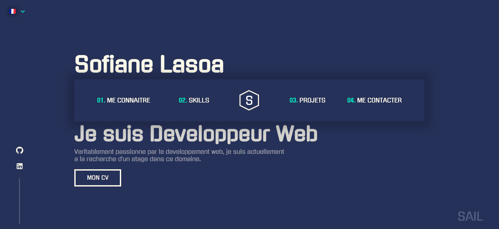

<br />
<br />
<div align="center">
  <a href="https://github.com/othneildrew/Best-README-Template">
    
  </a>

<h3 align="center" style="font-size: 30px">My Portfolio</h3>
  <p align="center" style="font-size: 18px">
    An awesome portfolio
    <br />
    <a href="https://sofianelasoa.com/">View Demo</a>
  </p>
</div>

## About The Project
<br />



<br />

🚀 Hello there! I'm excited to share with you my carefully designed and coded portfolio. This project is an open invitation 
for you to explore, personalize, and showcase your unique identity online.

Key Features:
* 🎨 Clean and modern design
* 💻 Responsive layout for various devices
* 🌐 Easy-to-update content sections
* 🚀 Ready for quick deployment on GitHub Pages

Feel free to reach out if you have any questions or suggestions. Let your portfolio be a true reflection of who you are!

Happy coding! 🌟

### Built With

* [![React][React.js]][React-url]
* [![React][Styled-components]][Styled-Components-url]
* [![Sass][Sass]][Sass-url]
* [![Javascipt][Javascript]][Javascript-url]

## Getting Started
<br />
🚀 Follow these steps to get the project up and running on your local machine.

### Prerequisites

Make sure you have the following installed on your machine:

- [Node.js](https://nodejs.org/) (Version 12 or higher)
- [npm](https://www.npmjs.com/) (Node Package Manager)

### Installation

1. **Fork the repository**
2. **Clone the repository:**

    ```bash
    git clone https://github.com/your-username/portfolio-v2.git
   ```
   
3. **Navigate to the project directory:**

    ```bash
    cd portfolio-v2
    ```

4. **Install dependencies:**

    ```bash
    npm install
    ```
   
### Running Locally

1. **Start the development server:**

    ```bash
    npm start
    ```

2. **Open your browser:**

   Visit [http://localhost:3000](http://localhost:3000) to view your portfolio.

To personalize the portfolio, open all the contents files and replace all my information with yours

[Styled-components]: https://img.shields.io/badge/Styled%20Components-35495E?style=for-the-badge&logo=styled-components&logoColor=#bf4080
[Styled-Components-url]: https://styled-components.com/
[React.js]: https://img.shields.io/badge/React-20232A?style=for-the-badge&logo=react&logoColor=61DAFB
[React-url]: https://reactjs.org/
[Sass]: https://img.shields.io/badge/Sass-000000?style=for-the-badge&logo=sass&logoColor=#bf4080
[Sass-url]: https://sass-lang.com/
[Javascript]: https://img.shields.io/badge/Javascript-563D7C?style=for-the-badge&logo=javascript
[Javascript-url]: https://developer.mozilla.org/fr/docs/Web/JavaScript

#### Sofiane Lasoa
